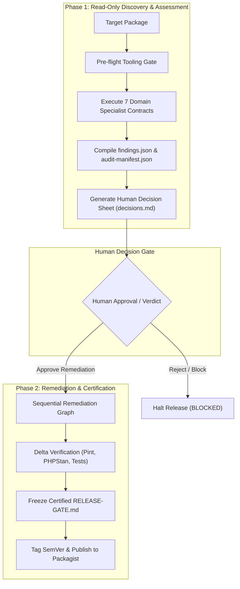

<h1 align="center">🛡️ Laravel Package Audit Framework</h1>

<p align="center">
  <strong>Industrial pre-release verification and certification standard for modern Laravel & PHP packages</strong>
</p>

<p align="center">
  <a href="#-the-7-specialized-audit-gates">The 7 Audit Gates</a> •
  <a href="#-the-2-phase-audit-lifecycle">2-Phase Lifecycle</a> •
  <a href="#-ai-agent--skill-installation">Skill Installation</a> •
  <a href="#-release-gate-certification">Certification Spec</a> •
  <a href="#-examples">Examples</a> •
  <a href="CHANGELOG.md">Changelog</a>
</p>

<p align="center">
  <a href="https://github.com/alex-kassel/laravel-package-audit"></a>
  <a href="https://laravel.com"></a>
  <a href="https://php.net"></a>
  <a href="LICENSE"></a>
</p>

---

## 🌟 Overview

**Laravel Package Audit Framework** is an open-source, deterministic verification specification designed for autonomous AI coding agents (Antigravity, Cursor, Claude Code, Windsurf, Copilot) and human maintainers to perform 360-degree quality audits on PHP/Laravel packages before publishing to Packagist.

Every audited package is verified against **7 specialized domain contracts** and certified with an immutable `RELEASE-GATE.md` snapshot.

---

## 🔬 The 7 Specialized Audit Gates

| # | Gate Domain | Focus Area | Deterministic Verification Standard |
|:---:|---|---|---|
| **01** | **Architecture & API** | Public surface & isolation | Backward compatibility, encapsulation, zero host framework leakage. |
| **02** | **Code Quality & Types** | Static analysis & styling | PHPStan Level 8+, `declare(strict_types=1)`, Laravel Pint formatting. |
| **03** | **Database & Storage** | Migrations & schema safety | Multi-connection isolation, isolated SQLite/MySQL test harness. |
| **04** | **Security & Isolation** | Secrets & container safety | No credential leaks, service container pollution prevention, input sanitization. |
| **05** | **Supply Chain & Composer** | Dependency integrity | `composer validate --strict`, `.gitattributes` export-ignore, strict SemVer bounds. |
| **06** | **Testing & Compatibility** | Automated test matrix | Complete unit/feature test coverage across PHP 8.2–8.4 and Laravel 10–13. |
| **07** | **Consumer DX & Release** | Developer experience | Canonical README, Keep-a-Changelog compliance, `RELEASE-GATE.md` certificate. |

---

## 🔄 The 2-Phase Audit Lifecycle



---

## 🤖 AI Agent & Skill Installation

This repository adheres to the universal Agentic Skill specification (`SKILL.md`). You can install it directly into your workspace for any AI coding assistant.

### 1. For Google Antigravity & Workspace Agent Tools
Copy the framework directly into your workspace skills directory:
```bash
# Inside your workspace root
mkdir -p .agents/skills/package-audit
git clone --depth 1 https://github.com/alex-kassel/laravel-package-audit .agents/skills/package-audit
```

### 2. For Cursor IDE
```bash
# Inside your Cursor workspace
mkdir -p .cursor/skills/package-audit
git clone --depth 1 https://github.com/alex-kassel/laravel-package-audit .cursor/skills/package-audit
```

### 3. Prompting Your AI Assistant
Once installed, simply request a full package audit in chat:
> *"Run a full package audit on `packages/alex-kassel/my-package` using the package-audit skill."*

---

## 🚦 Release Gate Certification (`RELEASE-GATE.md`)

When an audit completes and all checks pass, the framework outputs an immutable `RELEASE-GATE.md` file in the package root. Packages link to this verification in their `README.md` via the canonical badge:

```markdown
[](RELEASE-GATE.md)
```

### Certified Attributes:
* **Package Name & Target Version:** Certified SemVer version and commit SHA.
* **Domain Assessment Grid:** Individual verdicts across all 7 verification domains.
* **Deterministic Tool Evidence:** Exact output lines from PHPUnit, PHPStan, Pint, and Composer.
* **Digital Audit Trail:** Machine-readable JSON summary for CI/CD gates.

---

## 📁 Repository Structure

```text
├── SKILL.md                  # Universal AI Agent Skill entry point
├── references/               # Knowledge base & domain contracts
│   ├── orchestrator.md       # Master Orchestrator contract & execution lifecycle
│   ├── audit-contracts.md    # Index of specialized contracts
│   └── agents/               # 7 specialized domain agent contracts (01 to 07)
├── resources/                # Schemas and report templates
│   ├── schema/               # JSON Schema Draft-07 (findings, agent reports)
│   └── templates/            # audit-manifest & RELEASE-GATE.md templates
├── examples/                 # Real-world certified audit runs and snapshots
├── CHANGELOG.md              # Framework version history
└── LICENSE                   # MIT License
```

---

## 📄 Examples

Inspect [examples/scraper-core/](examples/scraper-core/) to see an end-to-end audit artifact run, including `findings.json`, `decisions.md`, `FINAL-REPORT.md`, and the certified `RELEASE-GATE.md`.

---

## 📜 Changelog

Please see [CHANGELOG.md](CHANGELOG.md) for details on framework updates and release versions.

---

## 👤 Author & Maintainer

* **Alexander Macenko** ([@alex-kassel](https://github.com/alex-kassel)) — Author & Framework Steward

---

## ⚖️ License

The MIT License (MIT). Please see [LICENSE](LICENSE) for more information.
