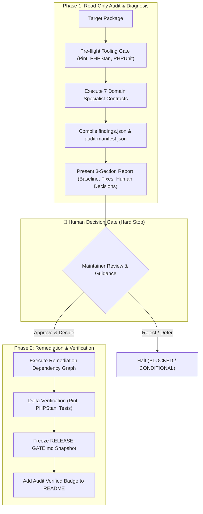

<h1 align="center">🛡️ Laravel Package Audit Framework</h1>

<p align="center">
  <strong>A structured pre-release verification and quality assurance framework for Laravel and PHP packages</strong>
</p>

<p align="center">
  <a href="#-the-7-verification-domains">The 7 Domains</a> •
  <a href="#-2-phase-audit-lifecycle">2-Phase Lifecycle</a> •
  <a href="#-ai-agent--skill-installation">Skill Installation</a> •
  <a href="#-release-gate-verification-snapshot">Verification Snapshot</a> •
  <a href="CHANGELOG.md">Changelog</a>
</p>

<p align="center">
  <a href="https://github.com/alex-kassel/laravel-package-audit"></a>
  <a href="https://laravel.com"></a>
  <a href="https://php.net"></a>
  <a href="LICENSE"></a>
</p>

---

## 🌟 Overview

**Laravel Package Audit Framework** is an open-source verification framework and universal Agentic Skill (`SKILL.md`) designed for autonomous AI coding agents (such as Google Antigravity, Cursor, Windsurf, Claude Code, GitHub Copilot) and human maintainers to conduct thorough 360-degree quality audits on PHP and Laravel packages prior to publishing.

The framework enforces evidence-based verification against **7 specialized domain contracts** and structures pre-release reviews through a transparent **2-phase lifecycle with an explicit Human Decision Gate**.

---

## 🔬 The 7 Verification Domains

| # | Verification Domain | Contract | Focus Area | Verification Standard |
|:---:|---|---|---|---|
| **01** | **Architecture & API** | [`01_architecture_api.md`](references/agents/01_architecture_api.md) | Public API & boundaries | Backward compatibility, encapsulation, safe ServiceProvider registration. |
| **02** | **Code Quality & Types** | [`02_code_quality.md`](references/agents/02_code_quality.md) | Static analysis & styling | PHPStan Level 8+, `declare(strict_types=1)`, Laravel Pint formatting. |
| **03** | **Database & Storage** | [`03_database.md`](references/agents/03_database.md) | Migrations & schema safety | Migration idempotency, SQLite/MySQL isolation, dynamic storage contexts. |
| **04** | **Security & Isolation** | [`04_security_isolation.md`](references/agents/04_security_isolation.md) | Host safety & injection | No secret leaks, container pollution prevention, input sanitization. |
| **05** | **Supply Chain & Composer** | [`05_composer_supply_chain.md`](references/agents/05_composer_supply_chain.md) | Distribution integrity | `composer validate --strict`, `.gitattributes` export-ignore, clean archive. |
| **06** | **Testing & Compatibility** | [`06_testing_compatibility.md`](references/agents/06_testing_compatibility.md) | Automated test suite | Unit/Feature test suite coverage across declared PHP & Laravel matrix. |
| **07** | **Consumer DX & Release** | [`07_consumer_release.md`](references/agents/07_consumer_release.md) | Developer experience | Canonical README, Keep-a-Changelog compliance, verification snapshot. |

---

## 🔄 2-Phase Audit Lifecycle

The audit workflow is strictly divided into two distinct phases separated by an explicit human checkpoint:



### Phase 1: Read-Only Audit (🛑 Hard Stop)
1. **Zero Code Modification**: The auditor inspects the codebase without altering any files.
2. **Deterministic Baseline**: Runs CLI checks (`composer validate`, `pint --test`, `phpstan`, `phpunit`).
3. **Structured 3-Section Chat Report**:
   - **Section 1**: Test and tooling execution summary.
   - **Section 2**: Planned mechanical fixes (formatting, type hints, docblocks).
   - **Section 3**: Critical decision points (public API changes, method signatures, schema alterations) with the agent's technical recommendation and rationale.
4. **Hard Stop**: The agent halts execution and waits for human confirmation before modifying any code.

### Phase 2: Remediation & Verification
1. **Sequential Fix Graph**: Applies fixes following the dependency hierarchy (Architecture $\rightarrow$ API/DB $\rightarrow$ Types $\rightarrow$ Tests).
2. **Delta Verification**: Re-runs all test suites and static analysis tools to verify fixes and ensure zero regressions.
3. **Verification Snapshot**: Generates the final `RELEASE-GATE.md` snapshot in the package root.

---

## 🤖 AI Agent & Skill Installation

This repository follows the universal Agentic Skill specification ([`SKILL.md`](SKILL.md)). It can be integrated into any AI-assisted development workflow.

### 1. Google Antigravity & AI Agent Workspaces
Clone or link the repository into your workspace skills directory:
```bash
mkdir -p .agents/skills/package-audit
git clone --depth 1 https://github.com/alex-kassel/laravel-package-audit .agents/skills/package-audit
```

### 2. Cursor IDE
```bash
mkdir -p .cursor/skills/package-audit
git clone --depth 1 https://github.com/alex-kassel/laravel-package-audit .cursor/skills/package-audit
```

### 3. Prompting Your AI Assistant
Once installed, trigger an audit in chat:
> *"Run a full package audit on `packages/vendor/package-name` using the package-audit skill."*

---

## 🚦 Release Gate Verification Snapshot (`RELEASE-GATE.md`)

When an audit successfully completes, the framework generates a frozen `RELEASE-GATE.md` snapshot in the package root. Packages link to this report in their `README.md` via the standard verification badge:

```markdown
[](RELEASE-GATE.md)
```

### Recorded Attributes:
* **Package Metadata:** Target SemVer version and exact Git commit SHA.
* **Domain Assessment Grid:** Individual verdicts across all 7 verification domains.
* **Deterministic Tool Evidence:** Exact output lines from PHPUnit, PHPStan, Pint, and Composer.
* **Audit Trail:** Machine-readable JSON summary for CI/CD pipeline verification.

---

## 📁 Repository Layout

```text
├── SKILL.md                  # Universal AI Agent Skill entry point
├── references/               # Knowledge base & domain contracts
│   ├── orchestrator.md       # Master Orchestrator contract & 2-phase lifecycle
│   ├── audit-contracts.md    # Index of specialized domain contracts
│   └── agents/               # 7 specialized domain agent contracts (01 to 07)
├── resources/                # Schemas and report templates
│   ├── schema/               # JSON Schema Draft-07 (findings, agent reports)
│   └── templates/            # audit-manifest & RELEASE-GATE.md templates
├── CHANGELOG.md              # Framework version history
├── AGENTS.md                 # Agent guidelines & contract index
└── LICENSE                   # MIT License
```

---

## 📜 Changelog

Please see [CHANGELOG.md](CHANGELOG.md) for details on framework updates and release versions.

---

## 👤 Author & Maintainer

* **Alexander Macenko** ([@alex-kassel](https://github.com/alex-kassel)) — Author & Framework Steward

---

## ⚖️ License

The MIT License (MIT). Please see [LICENSE](LICENSE) for more information.
