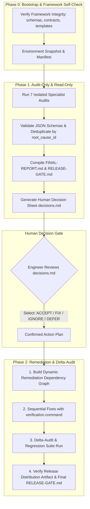

# 🚀 Laravel Package Audit Framework (`.audit` v1.0.0)

> **An industrial, 360-degree, evidence-based release gating and audit framework for packages in the Laravel / Composer ecosystem preparing for a public `1.0.0` or stable Packagist release.**

---

## 📖 Table of Contents

- [Why This Framework Exists](#-why-this-framework-exists)
- [Architecture & The 7 Specialized Audit Domains](#-architecture--the-7-specialized-audit-domains)
- [The 2-Phase Lifecycle](#-the-2-phase-lifecycle)
- [Quickstart Guide for Developers](#-quickstart-guide-for-developers)
- [Release Gate Verdicts](#-release-gate-verdicts)
- [Monorepo & Root Vendor Integration](#-monorepo--root-vendor-integration)
- [Directory & Artifact Layout](#-directory--artifact-layout)
- [Configuration & Schemas](#-configuration--schemas)

---

## 🎯 Why This Framework Exists

Releasing a production-ready open-source or commercial Laravel package is notoriously difficult. Common pitfalls before a `1.0.0` release include:

- **Host Container Pollution**: Overwriting host singletons without conditional guards (`bindIf`, `singletonIf`).
- **Hidden BC Breaks & Leaked Internals**: Exposing internal implementation details that break consumers during minor updates.
- **Supply Chain & Packaging Flaws**: Forgetting `export-ignore` in `.gitattributes`, causing test suites, `.env`, and CI workflows to be distributed via Packagist zip archives.
- **Database Pitfalls**: Unprefixed generic table names colliding with host apps, unindexed foreign keys, or broken rollback scripts.
- **Typing & Quality Deficits**: Hiding static analysis errors in `phpstan-baseline.neon` instead of fixing root typing problems.
- **Broken Consumer Experience**: Quickstart README code snippets that fail upon fresh installation.

The **Laravel Package Audit Framework** provides an automated, rigorous, and deterministic 360-degree inspection system powered by 7 specialized audit contracts. It operates strictly on **evidence over opinions**, categorizes findings by root cause, and provides a structured Human-in-the-Loop decision gate before any code changes are made.

---

## 🛡️ Architecture & The 7 Specialized Audit Domains

The framework delegates audit tasks across 7 isolated specialist domains:

```text
                                 ┌──────────────────────────────┐
                                 │   Lead Audit Orchestrator    │
                                 │      (orchestrator.md)       │
                                 └──────────────┬───────────────┘
                                                │
         ┌──────────────┬──────────────┬────────┴─────┬──────────────┬──────────────┬──────────────┐
         ▼              ▼              ▼              ▼              ▼              ▼              ▼
   ┌───────────┐  ┌───────────┐  ┌───────────┐  ┌───────────┐  ┌───────────┐  ┌───────────┐  ┌───────────┐
   │ Agent 01  │  │ Agent 02  │  │ Agent 03  │  │ Agent 04  │  │ Agent 05  │  │ Agent 06  │  │ Agent 07  │
   │Architect. │  │   Code    │  │ Database  │  │ Security  │  │ Composer  │  │  Testing  │  │ Consumer  │
   │   & API   │  │  Quality  │  │& Migration│  │& Isolation│  │& Packaging│  │& Compatib.│  │ & Release │
   └─────┬─────┘  └─────┬─────┘  └─────┬─────┘  └─────┬─────┘  └─────┬─────┘  └─────┬─────┘  └─────┬─────┘
         │              │              │              │              │              │              │
         └──────────────┴──────────────┴───────┬──────┴──────────────┴──────────────┴──────────────┘
                                               │
                                       (JSON Validation)
                                               ▼
                                  ┌─────────────────────────┐
                                  │   findings.json (Dedupe)│
                                  │   decisions.md (Human)  │
                                  │   RELEASE-GATE.md       │
                                  │   DASHBOARD.md          │
                                  └─────────────────────────┘
```

| Agent | Focus Domain | Key Checks & Deterministic Tools |
|---|---|---|
| **01 Architecture & API** | Public contract stability & Laravel integration | ServiceProvider `register()` vs `boot()`, container bindings, facades, DTOs, `@internal` encapsulation, SemVer boundaries. |
| **02 Code Quality** | Static analysis, strict typing & linting | `declare(strict_types=1);`, return/param types, Pint (`pint --test`), PHPStan (highest reasonable strictness), baseline audit. |
| **03 Database** | Migrations, DDL, queries & concurrency | `up()`/`down()` reversibility, table prefix collisions, index coverage, N+1 queries, transactions (`DB::transaction()`), multi-DB support. |
| **04 Security & Isolation** | Vulnerabilities & host app containment | Container hijacking prevention, global config immutability, SQL/Command injection, unescaped Blade output, `composer audit`. |
| **05 Composer & Supply Chain** | Manifest, dependencies & distribution zip | `composer validate --strict`, dependency segregation (`require` vs `require-dev`), `.gitattributes export-ignore`, `git archive` release check. |
| **06 Testing & Matrix** | Test quality & boundary compatibility | PHPUnit/Pest with Testbench, dynamic `tests/bootstrap.php`, boundary matrix testing (`prefer-lowest` vs `prefer-stable`). |
| **07 Consumer Release** | First-party integration & documentation | Isolated fresh-install smoke test (no parent vendor leakage), auto-discovery, `vendor:publish`, README code accuracy, `CHANGELOG.md`, `LICENSE`. |

---

## 🔄 The 2-Phase Lifecycle

The audit framework operates in two distinct phases preceded by a bootstrap self-check:



---

## 🚀 Quickstart Guide for Developers

### Step 1: Requesting an Audit

Give a simple prompt to your AI coding assistant (Antigravity, Cursor, Claude Code, Copilot):

> *"Run a full package audit for `packages/<vendor>/<package-name>` strictly according to `.audit/orchestrator.md`. Execute Phase 1 (Audit-Only)."*

The agent will automatically:
1. Conduct Phase 0 Framework Self-Check and initialize `.audit/runs/<vendor>/<package-name>/<timestamp>/`.
2. Execute all 7 specialist contracts in read-only mode.
3. Validate and deduplicate findings into `findings.json`.
4. Generate `FINAL-REPORT.md`, `RELEASE-GATE.md`, `decisions.md`, and update `.audit/DASHBOARD.md`.

---

### Step 2: Reviewing Decisions

Open `.audit/runs/<vendor>/<package-name>/latest/decisions.md`. You will see actionable architectural questions (typically 3–10 items) formatted with explicit choices:

```markdown
### [DB-001 / RC-MIGRATION-PREFIX]: Table `settings` is unprefixed
- **Impact**: Could collide with host application `settings` table.
- **Recommendation**: Make table prefix configurable via `config('package.table_prefix')`.
- **Options**:
  - [x] `FIX`: Refactor migration and model to support configurable prefix.
  - [ ] `ACCEPT`: Accept risk (table name is an intentional public contract).
  - [ ] `IGNORE`: Ignore (justify why).
  - [ ] `DEFER`: Defer to next minor version.
```

Mark your choices directly in the file.

---

### Step 3: Triggering Remediation

Instruct the agent:

> *"Execute Phase 2 (Remediation) for `packages/<vendor>/<package-name>` based on confirmed decisions in `decisions.md`."*

The agent will execute fixes along the **Remediation Dependency Graph**, run every finding's `verification.command`, conduct a delta regression audit, inspect the release archive, and issue the final `RELEASE-GATE.md`.

---

## 🚦 Release Gate Verdicts

Every audit produces a clear, deterministic release verdict:

| Verdict | Meaning | Conditions Required |
|:---:|---|---|
| 🟢 **`READY`** | **No known release-blocking issues were found, and all required verification gates passed** | `0` Blockers, `0` Critical defects, all required audits `PASS`, all human decisions resolved, verified compatibility, clean distribution archive. |
| 🟡 **`CONDITIONAL`** | **Approved with documented risks or minor pending items** | `0` Blockers, `0` Critical defects, non-critical decisions pending or explicitly accepted architectural tradeoffs. |
| 🔴 **`BLOCKED`** | **Release MUST NOT proceed** | `>= 1` Blocker or Critical finding, broken Composer install/discovery, fatal security flaw, migration failure, or failed essential audit. |

---

## 🧩 Execution Modes: Standalone vs Monorepo Workspace

The framework is **universal and repository-agnostic**:

1. **Standalone Package Mode (Default)**:
   - When auditing a standalone package repository, tools run within the package's own context and isolated dependencies.

2. **Monorepo / Workspace Adapter (Optional)**:
   - In local monorepo setups (such as Laravel host applications developing multiple internal packages), test runners can optionally use the host root `vendor/` via a dynamic autoloader (`tests/bootstrap.php`) for rapid local iteration.
   - **Critical Isolation Rule**: Regardless of monorepo tooling, the Consumer Release Agent (Agent 07) MUST verify that the package resolves runtime dependencies independently without leaking undeclared parent packages.

---

## 📁 Directory & Artifact Layout

```text
.audit/
├── DASHBOARD.md                    # 🌟 Monorepo Audit Registry & Live Dashboard
├── README.md                       # Framework guide & execution manual (this file)
├── AGENTS.md                       # AI Agent Guidelines & Architecture Map
├── orchestrator.md                 # Master Orchestrator Contract
├── audit-manifest.template.json    # Environment snapshot template
│
├── schema/
│   ├── finding.schema.json         # JSON schema for findings (severity, root_cause_id, verification)
│   └── agent-report.schema.json    # JSON schema for agent reports (status, tools_run, tools_missing)
│
├── agents/                         # 7 specialized audit contracts
│   ├── 01_architecture_api.md
│   ├── 02_code_quality.md
│   ├── 03_database.md
│   ├── 04_security_isolation.md
│   ├── 05_composer_supply_chain.md
│   ├── 06_testing_compatibility.md
│   └── 07_consumer_release.md
│
└── runs/                           # 📂 Historical & Latest Audit Outputs by Package
    └── <vendor>/
        └── <package-name>/
            ├── latest/             # Mirror of latest completed audit
            │   ├── audit-manifest.json
            │   ├── findings.json
            │   ├── decisions.md
            │   ├── FINAL-REPORT.md
            │   ├── RELEASE-GATE.md
            │   ├── findings/       # (01_architecture.json, 02_code_quality.json ...)
            │   └── reports/        # (01_architecture.md, 02_code_quality.md ...)
            └── <YYYY-MM-DD_HH-mm-ss>/ # Immutable historical audit snapshots
```

---

## 📄 License & Attribution

Distributed under the **MIT License**. Created for high-assurance package engineering in the Laravel ecosystem.
